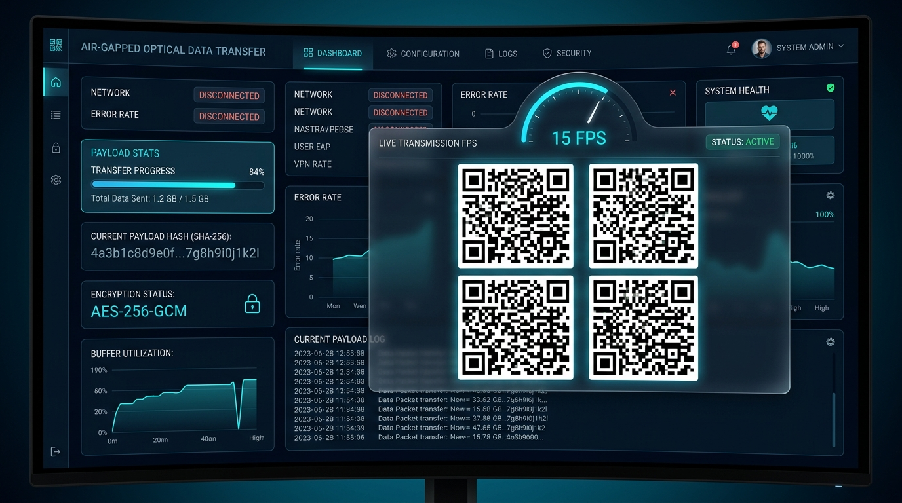
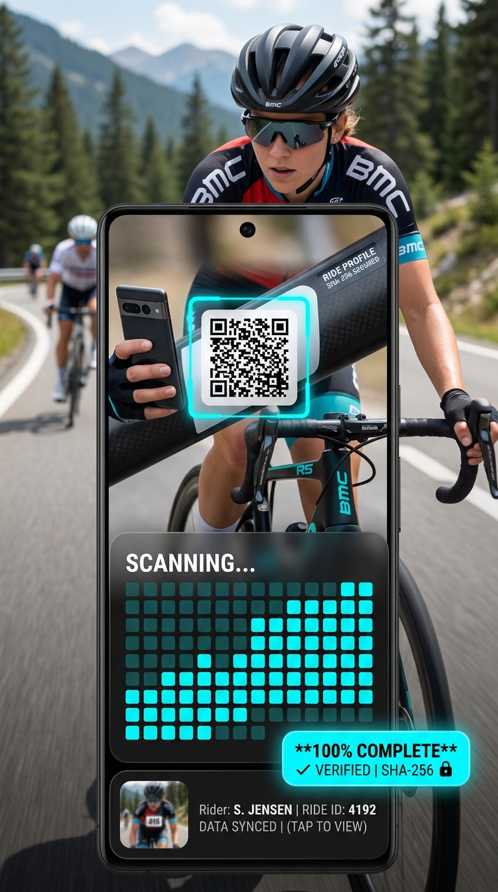

# ⚡ Air-Gapped Optical QR Transfer Engine

[](https://github.com/aaqibsaleem/optical-qr-transfer/actions)
[](https://aaqibsaleem.github.io/optical-qr-transfer/)
[](LICENSE)
[](docs/protocol-spec.md)
[](https://nodejs.org)
[](test/)

An air-gapped, zero-network optical data transfer platform. A PC displays rapidly cycling, Base45-encoded binary QR frames, while a mobile phone scans the stream via any browser (`getUserMedia`) to reassemble text, JSON, images, and binary files with **end-to-end SHA-256 cryptographic verification**.

> 🚀 **Live Browser Demo**: **[https://aaqibsaleem.github.io/optical-qr-transfer/](https://aaqibsaleem.github.io/optical-qr-transfer/)**  
> *(Test instantly in your browser without installing dependencies. Camera HTTPS context pre-configured!)*

---

## 📸 Portfolio Demonstration

| PC Sender Platform (Multi-QR Stream) | Mobile Receiver Platform (Camera Scan & Preview) |
|:---:|:---:|
|  |  |

---

## 🔒 The Air-Gapped Network Invariant

```
       ┌─────────────────────────────────────────────────────────────┐
       │                    PC SENDER DISPLAY                        │
       │     (Generates Base45 Encoded Binary QR Stream)             │
       └──────────────────────────────┬──────────────────────────────┘
                                      │
                           OPTICAL CHANNEL ONLY
                        (Camera Lens Scanning)
                                      │
                                      ▼
       ┌─────────────────────────────────────────────────────────────┐
       │                   MOBILE PHONE RECEIVER                     │
       │    (Off-Thread Web Worker Decoding & Local SHA-256 Check)    │
       └──────────────────────────────┬──────────────────────────────┘
                                      │
                             ZERO NETWORK CALLS
                     (100% Offline Payload Reassembly)
```

> **Guiding Principle**: The local web server acts *strictly* as a static asset delivery mechanism during initial page load. Once loaded, **the data payload travels 100% physically through light emitted by the PC screen into the mobile camera lens**. The receiver page contains **zero** `fetch`, `XMLHttpRequest`, or `WebSocket` calls for payload transmission or acknowledgements.

---

## ✨ Engineering & Architectural Highlights

* **🚀 Multi-QR Grid Tiling (Up to 15 KB/s Throughput)**: Supports `1x1` single, `2x1` dual, and `2x2` quad-QR side-by-side grid layouts. Hardware-accelerated native `BarcodeDetector` API scans multiple QR codes per camera frame simultaneously.
* **📦 Hand-Rolled Base45 Encoder (RFC 9285)**: Custom isomorphic implementation of Base45 encoding (as used in EU Digital COVID Certificates), fitting binary data into QR Alphanumeric mode for **~20% higher density** compared to standard Base64.
* **🛡️ Dual-Layer Integrity Architecture**:
  * **Per-Chunk CRC32**: Fixed 32-bit checksum in every frame header for immediate drop-rejection of motion-blurred or reflected QR scans.
  * **End-to-End SHA-256**: Full-payload cryptographic hash verified upon reassembly.
* **⚡ Real-Time Dynamic Controls**: Live FPS slider adjustment updates transmission rate in real-time without interrupting active streams.
* **🔄 Automatic Session Reset**: Random 32-bit `sessionId` header automatically resets the receiver grid when a new session starts on the PC.
* **🧠 Off-Thread Worker Pipeline**: QR decoding (`jsQR` + `BarcodeDetector`) runs inside a dedicated `WebWorker` (`src/workers/decodeWorker.js`), keeping the camera preview UI at 60 FPS.
* **🔐 LAN HTTPS Bootstrap**: Automated IPv4 discovery and self-signed SAN certificate generator (`server/https-cert.js`) ensuring `getUserMedia` camera permission compatibility on mobile browsers.

---

## 📊 Throughput & Benchmark Comparison

| Layout Mode | QRs / Frame | Target FPS | Bytes / Chunk | Raw Throughput | Relative Speedup |
|:---|:---:|:---:|:---:|:---:|:---:|
| **1x1 Standard** | 1 | 8 FPS | 120 B | 960 B/s (~0.96 KB/s) | **1.0x Baseline** |
| **2x1 Dual Grid** | 2 | 10 FPS | 120 B | 2,400 B/s (~2.40 KB/s) | **2.5x Speedup** |
| **2x2 Quad Grid** | 4 | 12 FPS | 120 B | 5,760 B/s (~5.76 KB/s) | **6.0x Speedup** |
| **2x2 Aggressive** | 4 | 15 FPS | 250 B | 15,000 B/s (~15.0 KB/s) | **15.6x Speedup** |

---

## 📁 Repository Structure

```
optical-qr-transfer/
├── .github/
│   └── workflows/ci.yml       GitHub Actions CI workflow
├── README.md                  Project Overview & Documentation
├── LICENSE                    MIT License
├── package.json               Dependencies & Scripts
├── vitest.config.js           Vitest runner configuration
├── scripts/
│   └── gen-cert.js            LAN HTTPS SSL certificate generator
├── server/
│   ├── index.js               Express server & static file host
│   ├── https-cert.js          Self-signed certificate generator with SAN IPv4
│   └── routes/
│       └── pairing.js         Pairing QR route
├── src/
│   ├── protocol/              ISOMORPHIC PROTOCOL ENGINE (Dependency-Free)
│   │   ├── constants.js       Protocol magic bytes, versioning, headers
│   │   ├── base45.js          Base45 encode / decode (RFC 9285)
│   │   ├── checksum.js        CRC32 & SHA-256 wrappers
│   │   ├── frame.js           18-byte packed binary frame header
│   │   ├── chunker.js         Uint8Array buffer chunker
│   │   ├── session.js         Random session ID generator
│   │   ├── bitmap.js          Bitset chunk tracker
│   │   ├── reassembler.js     Buffer reassembler & SHA-256 validator
│   │   └── fileMeta.js        SESSION_META & FILE_META frame packagers
│   └── workers/
│       └── decodeWorker.js    Off-thread QR worker (BarcodeDetector + jsQR)
├── public/
│   ├── sender/                PC Sender Web App (HTML5, ES Modules, CSS)
│   └── receiver/              Mobile Receiver Web App (HTML5, Camera, CSS)
├── docs/
│   ├── architecture.md        System topology & Mermaid sequence diagrams
│   ├── protocol-spec.md       Binary frame specification (OQTP v1)
│   └── images/                Portfolio screenshots
└── test/
    ├── protocol/*.test.js      Unit tests per protocol module
    └── integration/
        └── simulated-loss.test.js  Integration test with 30% simulated frame loss
```

---

## 🛠️ Quick Start

### 1. Installation
```bash
git clone https://github.com/aqib/optical-qr-transfer.git
cd optical-qr-transfer
npm install
```

### 2. Run Test Suite
```bash
npm test
```

### 3. Start HTTPS Dev Server
```bash
npm run dev
```

Output:
```
==================================================
🔒 HTTPS Server running at:
   - Localhost: https://localhost:3443/sender/
   - LAN IP:    https://192.168.1.120:3443/sender/
📱 Phone Receiver URL: https://192.168.1.120:3443/receiver/
==================================================
```

---

## 📖 System Architecture & Specification

For detailed technical specs, sequence diagrams, and binary header layouts:
- 📄 [System Architecture & Topology](docs/architecture.md)
- 📄 [Protocol Specification (OQTP v1)](docs/protocol-spec.md)

---

## 📜 License

MIT License. Developed for Portfolio & Advanced Engineering Demonstration.
