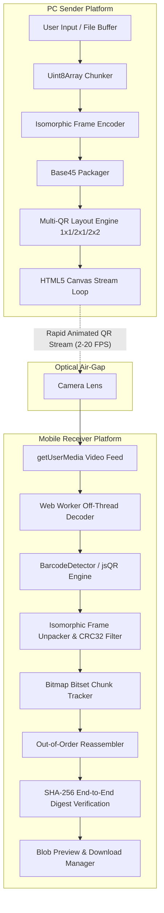
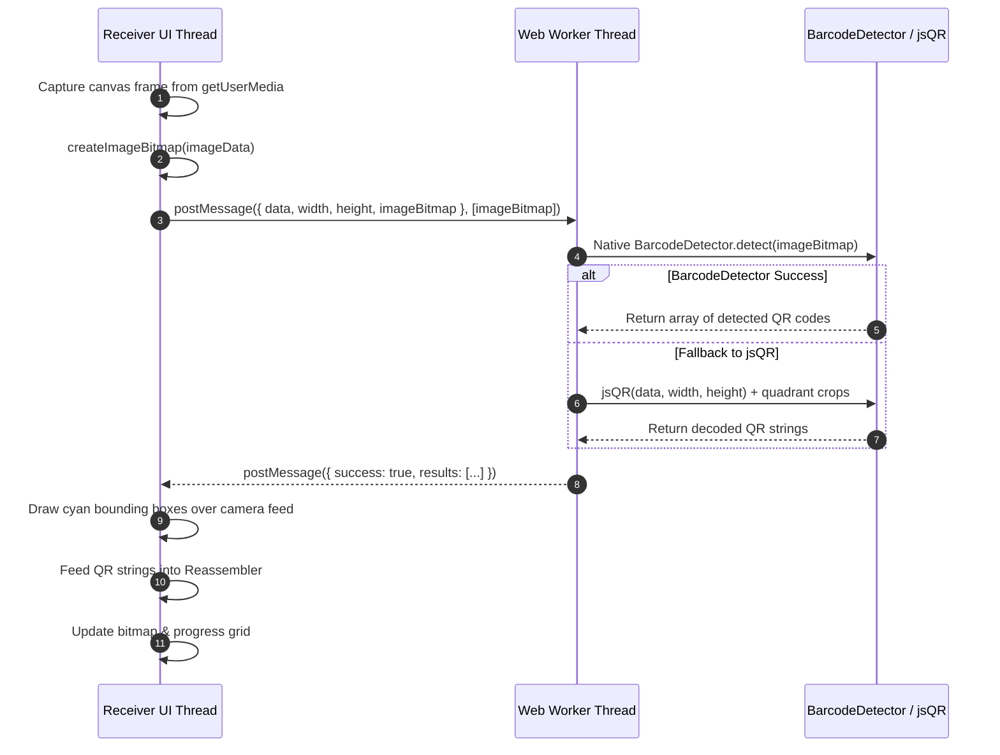

# System Architecture & Technical Specifications

## 1. Guiding Design Invariant

```
               ┌─────────────────────────────────────────┐
               │         PC / Sender Display             │
               └────────────────────┬────────────────────┘
                                    │
                         OPTICAL CHANNEL ONLY
                        (Cycling QR Code Stream)
                                    │
                                    ▼
               ┌─────────────────────────────────────────┐
               │      Mobile Browser / Camera Scan       │
               └────────────────────┬────────────────────┘
                                    │
                          ZERO NETWORK CALLS
                (Local Reassembly & SHA-256 Check)
```

> **Zero-Network Invariant**: The network delivers static application assets (`HTML`/`JS`/`CSS`) during page load. The data payload travels **100% physically through the optical QR stream**. The receiver page invokes zero `fetch`, `XMLHttpRequest`, or `WebSocket` calls for payload state or acknowledgements.

---

## 2. System Component Topology



---

## 3. Optical Multi-QR Grid Throughput Analysis

To overcome single-QR density limitations, the system supports Multi-QR Grid Tiling (`1x1`, `2x1`, `2x2`):

| Layout | QRs per Frame | Target FPS | Bytes/Chunk | Raw Throughput | Relative Speedup |
|:---|:---|:---|:---|:---|:---|
| **1x1 Standard** | 1 | 8 FPS | 120 B | 960 B/s (~0.96 KB/s) | 1.0x Baseline |
| **2x1 Dual Grid** | 2 | 10 FPS | 120 B | 2,400 B/s (~2.4 KB/s) | 2.5x |
| **2x2 Quad Grid** | 4 | 12 FPS | 120 B | 5,760 B/s (~5.76 KB/s) | **6.0x Multiplier** |
| **2x2 Aggressive** | 4 | 15 FPS | 250 B | 15,000 B/s (~15 KB/s) | **15.6x Multiplier** |

---

## 4. Multi-Threaded Scanning Pipeline



---

## 5. Security & Verification Guarantees

1. **Air-Gapped Isolation**: Data payload cannot be intercepted over Wi-Fi or LAN because no packets are sent.
2. **Per-Frame Integrity**: Any frame corrupted by lens reflection or motion blur is instantly dropped via binary CRC32 checksum validation.
3. **End-to-End Payload Authenticity**: Complete payload is validated against a 256-bit SHA-256 digest before rendering or enabling file downloads.
